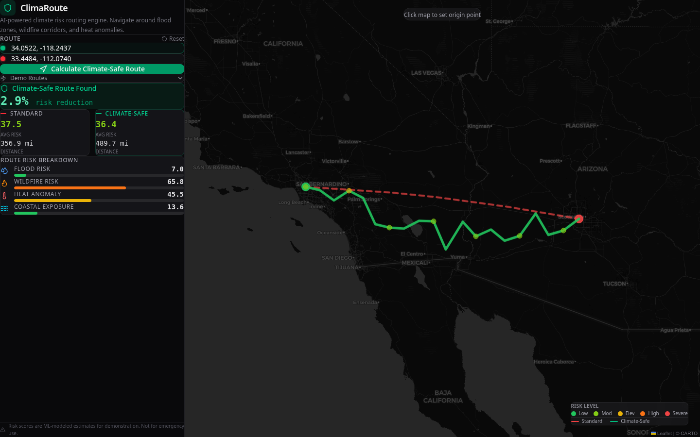

# ClimaRoute - AI-Powered Climate Risk Routing Engine

> Route smarter. Plan for climate reality.

ClimaRoute is an AI-powered routing engine that calculates climate-risk-optimized paths between any two geographic points. It uses machine learning to score flood zones, wildfire corridors, heat anomalies, and coastal exposure along route segments, then applies a modified Dijkstra's algorithm with risk-weighted edges to find safer alternatives.



## The Problem

Every year, over $250 billion in infrastructure damage comes from climate events that were predictable. Standard routing tools optimize for distance or time. They don't account for the growing reality of climate risk -- flood-prone corridors, wildfire zones, and urban heat islands that affect logistics, emergency response, and infrastructure planning.

## The Solution

ClimaRoute provides:

- **Climate Risk Scoring**: ML model (Gradient Boosting) trained on synthetic data derived from real geographic patterns (FEMA flood zones, NASA FIRMS wildfire data, NOAA climate normals) to score any lat/lng point from 0-100
- **Risk-Weighted Routing**: Modified Dijkstra's pathfinding that generates multiple candidate routes with lateral offsets and selects the lowest cumulative risk path
- **Interactive Visualization**: Dark-themed Leaflet map showing standard (red dashed) vs. climate-safe (green solid) routes with per-segment risk markers
- **Multi-Hazard Breakdown**: Flood, wildfire, heat anomaly, and coastal exposure scores for every route segment

## Architecture

```
Frontend (React + Vite + Tailwind)     Backend (Python FastAPI)
+---------------------------+          +---------------------------+
|  react-leaflet Map UI     | -------> |  /api/route               |
|  Route comparison panel   |  HTTP    |  /api/risk                |
|  Risk breakdown meters    |          |  /api/risk-grid           |
|  Demo preset routes       |          |  /api/presets             |
+---------------------------+          +---------------------------+
                                              |
                                       +------+------+
                                       |             |
                                  Risk Model    Route Engine
                                  (sklearn      (Modified
                                   GBR)         Dijkstra)
```

### Risk Model

The `ClimateRiskModel` uses a Gradient Boosting Regressor with 7 features per geographic point:

| Feature | Description | Data Source Pattern |
|---------|-------------|-------------------|
| Latitude | Geographic latitude | Input |
| Longitude | Geographic longitude | Input |
| Elevation | Estimated elevation (ft) | SRTM elevation patterns |
| Flood Zone Proximity | Proximity to flood-prone regions | FEMA NFHL patterns |
| Wildfire Risk Index | Fire risk based on region + vegetation | NASA FIRMS patterns |
| Heat Anomaly Score | Urban heat island effect | NOAA + population density |
| Coastal Proximity | Distance to nearest coastline | Geometric calculation |

The model captures nonlinear interactions (compound flood + heat risk) and produces a composite score (0-100) with risk level classifications: Low, Moderate, Elevated, High, Severe.

### Routing Algorithm

The `RouteEngine` generates climate-safe routes through:

1. Interpolate a standard route (great circle with curvature)
2. Generate 8 candidate routes with increasing lateral offsets perpendicular to the route vector
3. Score every waypoint on each candidate using the ML risk model
4. Select the candidate with the lowest cumulative risk
5. Return both standard and climate-safe routes for comparison

## Tech Stack

- **Frontend**: React 19, TypeScript, Vite, Tailwind CSS v4, react-leaflet, Leaflet.js, Lucide icons
- **Backend**: Python 3, FastAPI, scikit-learn (GradientBoostingRegressor), NumPy
- **Map Tiles**: CARTO Dark (dark_all)
- **Deployment**: Vercel (frontend) + Railway/Render (backend)

## Getting Started

### Prerequisites

- Node.js 18+
- Python 3.10+
- pip

### Backend Setup

```bash
cd backend
pip install fastapi uvicorn scikit-learn numpy requests
uvicorn main:app --host 0.0.0.0 --port 8000
```

The API will be available at `http://localhost:8000`. Test it:

```bash
curl "http://localhost:8000/api/risk?lat=34.05&lng=-118.24"
```

### Frontend Setup

```bash
npm install
npm run dev
```

The app will be available at `http://localhost:5173`.

## API Documentation

### GET /api/risk

Score climate risk for a single geographic point.

**Parameters**: `lat` (float), `lng` (float)

**Response**:
```json
{
  "overall_risk": 37.3,
  "flood_risk": 11.8,
  "wildfire_risk": 61.3,
  "heat_risk": 40.6,
  "coastal_exposure": 21.0,
  "elevation_ft": 1397.0,
  "risk_level": "moderate"
}
```

### GET /api/route

Calculate standard and climate-safe routes.

**Parameters**: `from_lat`, `from_lng`, `to_lat`, `to_lng` (float), `mode` ("standard" | "climate-safe")

**Response**: Route coordinates, per-segment risk scores, total risk, distance, and risk reduction percentage.

### GET /api/risk-grid

Get a grid of risk scores for heatmap overlay.

**Parameters**: `min_lat`, `max_lat`, `min_lng`, `max_lng` (float), `resolution` (int, 5-30)

### GET /api/presets

Get demo route presets.

## Demo Routes

| Route | Climate Risk Theme |
|-------|-------------------|
| LA to Phoenix | Southern California wildfire corridor |
| Miami to Atlanta | Hurricane belt + coastal flooding |
| Houston to Dallas | Compound heat + flood risk |
| SF to Portland | Pacific Northwest wildfire + smoke |
| NYC to DC | Atlantic seaboard storm surge |

## Use Cases

- **Emergency Vehicle Routing**: Route ambulances and fire trucks around active flood zones
- **Logistics Planning**: Optimize shipping routes for climate resilience
- **Urban Planning**: Identify climate-vulnerable corridors for infrastructure investment
- **Insurance Risk Assessment**: Evaluate route-level exposure for commercial fleets

## Future Development

- Integration with real-time FEMA, NASA FIRMS, and NOAA APIs for live risk data
- Road network graph routing using OpenStreetMap data
- Historical climate event overlay
- Export routes as GeoJSON/KML for GIS integration
- Mobile-responsive design for field use

## License

MIT

## Author

Bri Lindley - Full-Stack Developer & ML Engineer

Built for [AlgoFest Hackathon 2026](https://algofest-hackathon26.devpost.com/)
